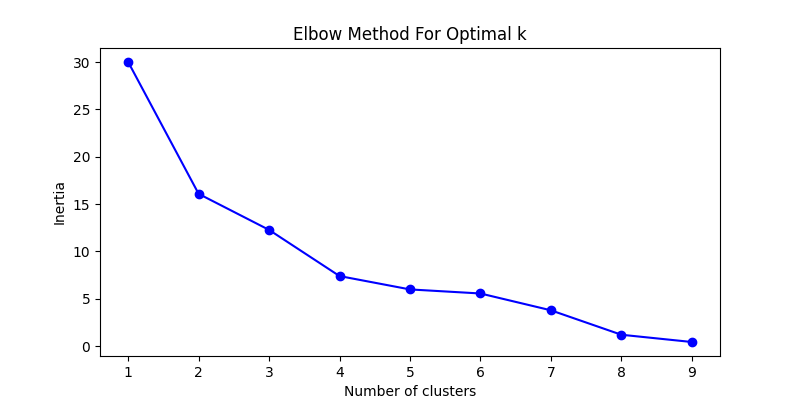
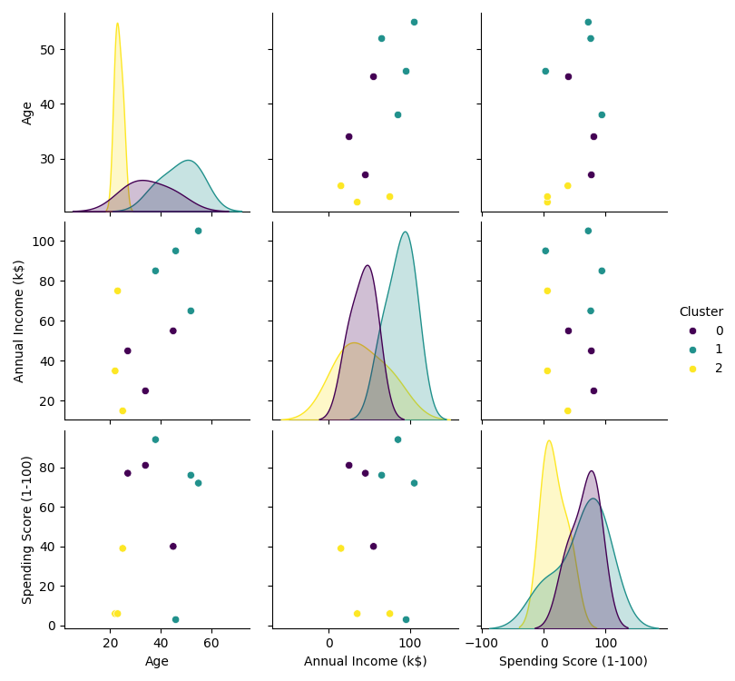

## Description

Melakukan customer market segmentation dengan cara yang efisien dan menentukan jumlah cluster yang optimal menggunakan metode elbow.

## Prerequisite

- Python
- PIP
- Pandas
- scikit-learn
- matplotlib
- seaborn

## Result

